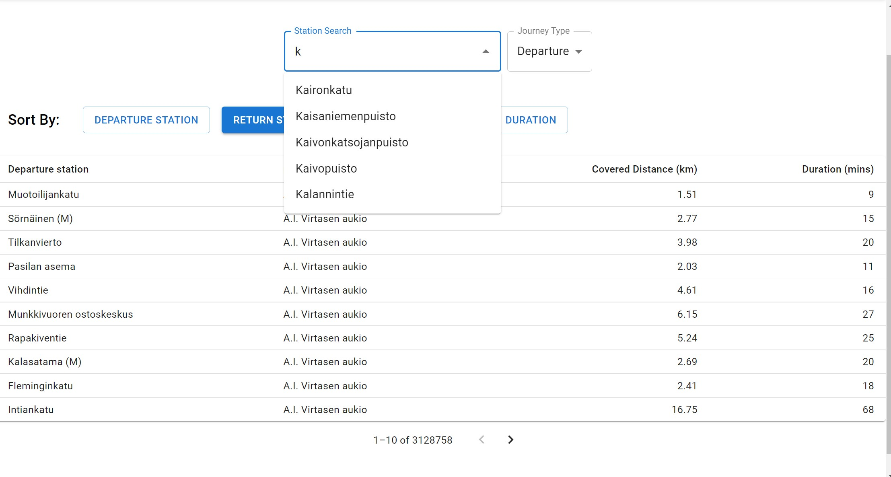
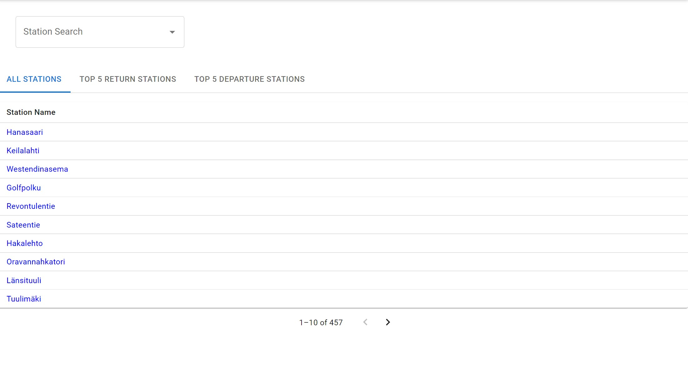
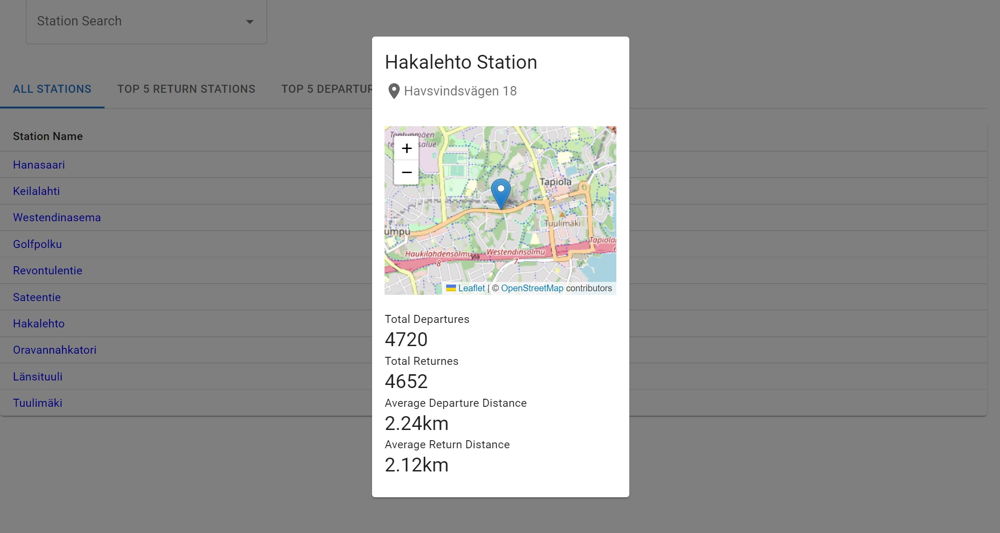

# CITY BIKE APP FRONTEND
## About
This repository contains code for the front end for CITY BIKE app. With this we can view information about bike station and journey details in Espoo region. Moreover, on station route we can also view more detailes about a station by clicking or searching the station name.

## Features 

### Journey View

<br>

- List of journeys with departure stations, return stations, covered distance in kilometers and duration in minutes is shown.
- Pagination
- Ordering per column
- Searching

### Station View

<br>
- List of all the stations.
- Pagination
- Searching
-  Top 5 most popular return stations
- Top 5 most popular departure stations

### Single station view (by clicking on station name on station page)

<br>
- Station name
- Station address
- Total number of journeys starting from the station
- Total number of journeys ending at the station
- The average distance of a journey starting from the station
- The average distance of a journey ending at the station
- Station location on map


## Tech

- ReactJS
- MaterialUI
- Axios

## How to run?

### BEFORE RUNNING FRONTEND MAKE SURE BACKEND IS RUNNING - https://github.com/sirbh/city-bike-backend

1. clone the repo using ``` git clone https://github.com/sirbh/city-bike-app.git```.
2. In the project directory run ```npm i```
3. Then run ```npm run dev```
4. Open the url which was generated as an output of above command

